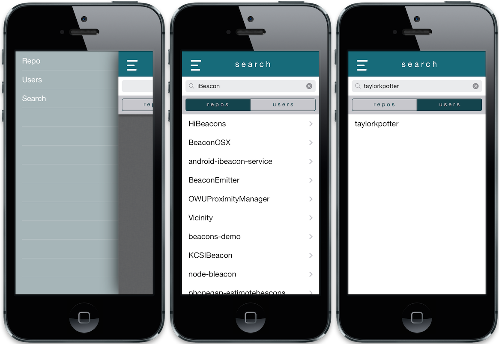

#Github Mobile

=====

This is a simple project demonstrating how to setup Github oAuth. Features include:

- Github authentication
- Load current authenticated user's repository list
- Search for repositories and load them in a web view
- Search for usernames and load their profile pages in a web view
